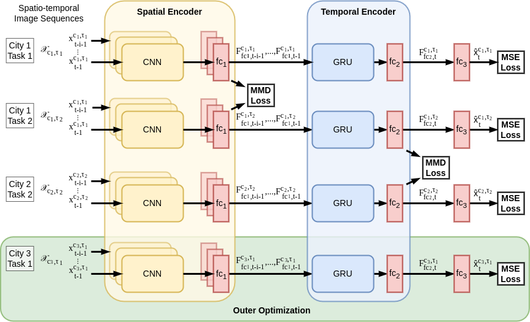

# MetaCitta: Deep Meta-Learning for Spatio- Temporal Prediction Across Cities and Tasks

Necessary code for the paper: [MetaCitta: Deep Meta-Learning for Spatio- Temporal Prediction Across Cities and Tasks](https://link.springer.com/chapter/10.1007/978-3-031-33383-5_6)



### Citation
Please cite the following if you use the code:
```
@InProceedings{10.1007/978-3-031-33383-5_6,
author="Sao, Ashutosh and Gottschalk, Simon and Tempelmeier, Nicolas and Demidova, Elena",
editor="Kashima, Hisashi and Ide, Tsuyoshi and Peng, Wen-Chih",
title="MetaCitta: Deep Meta-Learning for Spatio-Temporal Prediction Across Cities and Tasks",
booktitle="Advances in Knowledge Discovery and Data Mining",
year="2023",
publisher="Springer Nature Switzerland",
address="Cham",
pages="70--82",
isbn="978-3-031-33383-5"
}
```

### References

1. https://torch-two-sample.readthedocs.io/en/latest/
2. https://github.com/BruceBinBoxing/ST-ResNet-Pytorch

